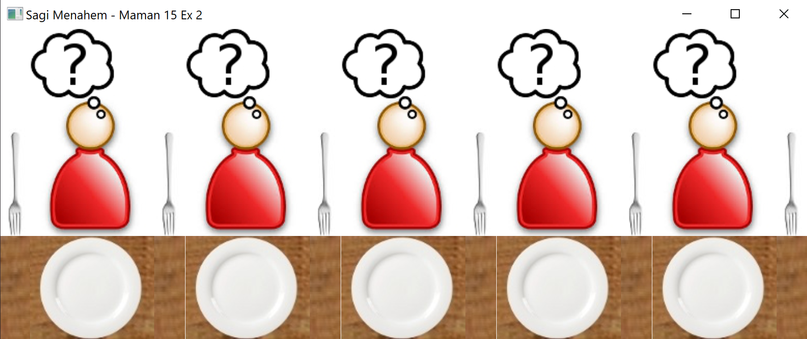
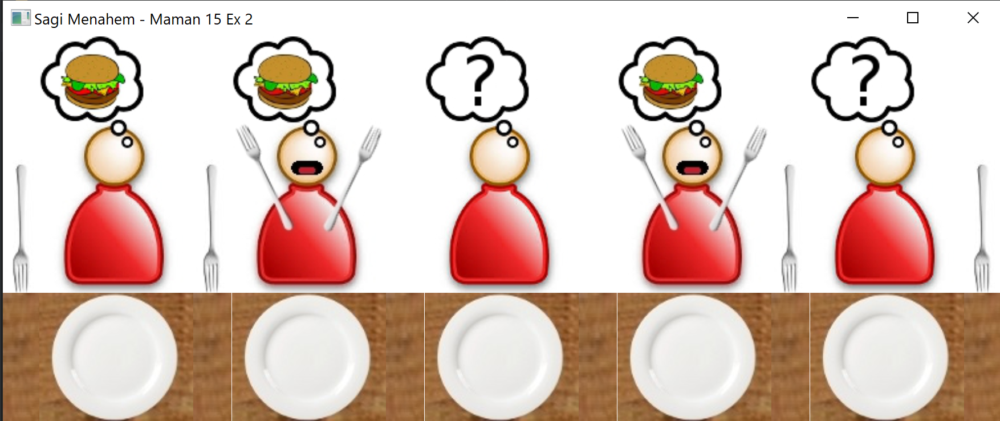

# Dining Philosophers Problem Simulation

Dining Philosophers Problem Simulation is a Java program that simulates the classic dining philosophers problem using JavaFX. The application visualizes philosophers, chopsticks, and their actions, providing insights into how philosophers share resources in a concurrent environment.

Task #5 for the 20554 java course of the Open University.

The full assignment (in Hebrew) is in the [Task 5.pdf](Task%205.pdf) file.

## Table of Contents

- [Introduction](#introduction)
- [Features](#features)
- [Classes Overview](#classes-overview)
- [Screenshots](#screenshots)
-  [Author](#author)

## Introduction

The application models the dining philosophers problem, a classic synchronization and concurrency problem, using JavaFX for the graphical user interface. Philosophers alternate between eating and thinking, using shared chopsticks. The program demonstrates how to manage shared resources in a multi-threaded environment.

## Features

1. **Visual Representation:** Visualizes philosophers, chopsticks, and their actions for a clear understanding of the dining philosophers problem.

2. **Dynamic Display:** Updates the graphical interface dynamically as philosophers engage in eating and thinking activities.

3. **Threaded Simulation:** Utilizes threads to simulate the independent actions of each philosopher, showcasing concurrent programming concepts.

## Classes Overview

1. **Maman15Ex2Controller:** Controls the JavaFX GUI, managing the visualization of philosophers, chopsticks, and their actions.

2. **Philosopher:** Represents a philosopher as a separate thread, alternating between eating and thinking.

3. **Chopstick:** Represents a chopstick with methods for acquiring and releasing it, ensuring safe resource sharing among philosophers.

4. **Main:** The entry point for the JavaFX application, initializing the stage, loading the FXML file, and setting up the application scene.

## Screenshots

## Author

Sagi Menahem.
